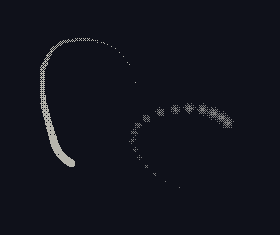

# 💫 xtrail

xtrail is a lightweight program designed to render trails behind the mouse cursor on X11-based systems. This doesn't require a compositor (but highly recommended for some programs) and utilizes dithering techniques for rendering with a minimalistic 1-bit "transparency" depth.



## Features

- Renders trails behind the mouse cursor with multiple render types.
- Supports customizable trail length and thickness.
- Adjustable mouse position history count.
- Configurable refresh rates for both rendering and mouse tracking.
- Trail is hidden when cursor is invisible (e.g., gaming)

## Installation

To build xtrail, simply use the provided Makefile by running `make` or `sudo make install`:
```sh
git clone https://github.com/algj/xtrail.git
cd xtrail
sudo make install

# try it out
xtrail --trail --color 0x7F7F7F

# to uninstall xtrail:
sudo make uninstall
```

## Usage

Once built, you can run xtrail with various options:

```
Usage: xtrail [OPTIONS]
Options:
  --help                       Display this help message
  --trail-length <length>      Set trail length to <length>
  --trail-thickness <px>       Set trail thickness to <px>
  --color <hex>                Set color to <hex> (e.g. 0x7F7F7F)
  --mouse-hcount <count>       Set position history count to <count>
  --refresh-rate <fps>         Set refresh rate count to <fps>
  --mouse-refresh-rate <hz>    Set mouse refresh rate count to <hz> (e.g. 240.00)
  --no-dither                  Disable dithering
  --mouse-share-thread         Synchronous rendering and mouse pooling
  --mouse-smooth-factor <val>  Adjusts the smoothness of mouse movements (e.g. 0 or 2)
  --mouse-empty-area <px>      Sets area around mouse which is not obfuscated by trails
Render type options:
  --trail                      Render "trail" type
  --dots                       Render "dots" type
```

## License

xtrail is licensed under the BSD 2-Clause License. See the `LICENSE` file for more details.

## Disclaimer

This project is provided as-is and may not receive regular updates or extensive support. Use it at your own discretion. Expect high CPU usage when running this.
